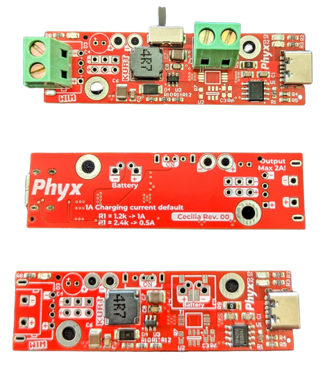
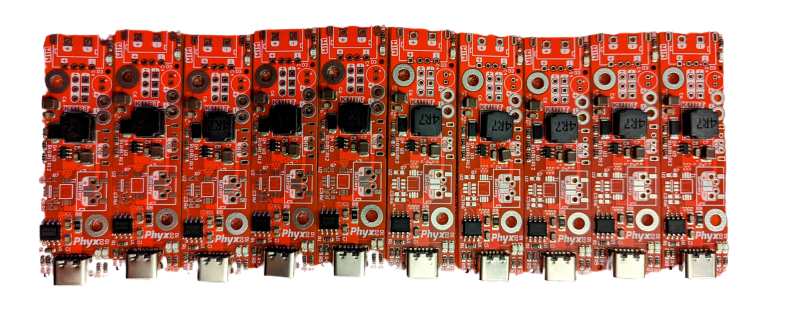

# CECILIA
For some projects we needed a 5V power supply from a lithium battery source that would not disable itself when there's not enough load attached. Not finding what we needed, we opted to build our own.
This project had been commissioned by [Kurt Beheydt](https://github.com/kurtbeheydt)

# REV 00

Based on the circuit used in the [Fri3d Camp Badge of 2018](https://github.com/Fri3dCamp/badge/tree/master) using a TP4056 charger and a SX1308 boost convertor.

